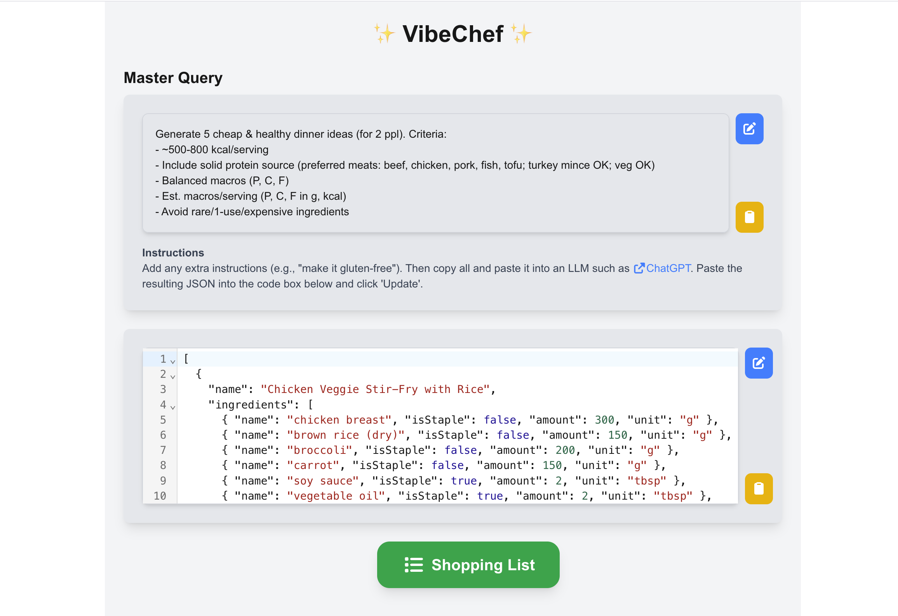

# ✨ VibeChef ✨

A recipe management webapp built with Next.js.

*This site makes use of local storage to save your master query and recipes. No data is sent to any server.*

*This app does not make use of AI directly, but instead comes with a predefined prompt that you can use with your favorite AI service.*

## Features

- Save and manage your curated master query
- Save and manage recipes
- Show ordered shopping lists made from all recipes
- 'Cook Mode' which prevents your screen from sleeping while cooking
- Easy no-fluff steps to follow (when using the default query)